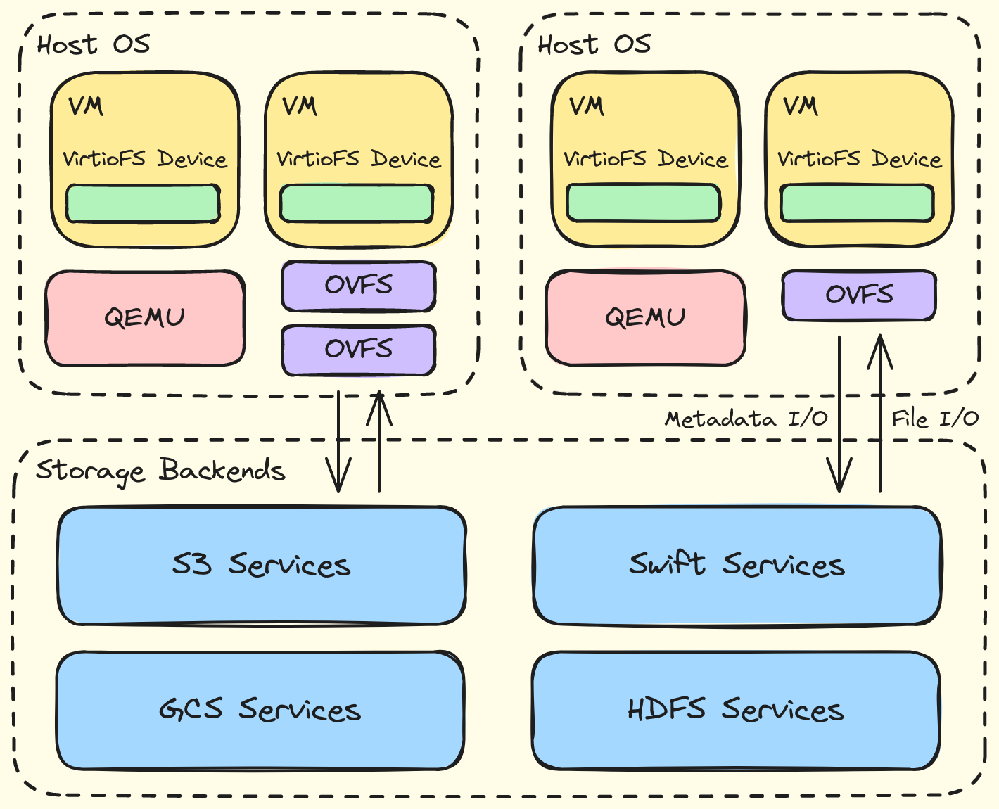

# OVFS, Sistema de Archivos OpenDAL a través de Virtio

OVFS es una implementación de backend para VirtioFS. Proporciona una interfaz de sistema de archivos para máquinas virtuales (VM) basada en [OpenDAL](https://github.com/apache/opendal), con el objetivo de acelerar el rendimiento de E/S de las VM mediante VirtIO y conectar sin problemas con varios backends de almacenamiento.



## Cómo usar

Se requieren los siguientes componentes:
- Entorno de Rust en el host para ejecutar OVFS.
- QEMU 4.2 o posterior para el soporte integrado de VirtioFS.
- Un kernel invitado (guest) de Linux 5.4 o posterior para el soporte integrado de VirtioFS.

### Instalar QEMU y las VMs

```shell
$ sudo apt-get install qemu qemu-kvm -y # debian/ubuntu
```

Descarga e instala la VM, tomando Ubuntu como ejemplo:

```shell
$ wget https://releases.ubuntu.com/20.04/ubuntu-20.04.6-live-server-amd64.iso
$ truncate -s 10G image.img
$ sudo qemu-system-x86_64 -enable-kvm -smp 2 -m 4G \
    -cdrom ubuntu-20.04.6-live-server-amd64.iso \
    -drive file=image.img,format=raw,cache=none,if=virtio \
    -no-reboot -boot d
```

### Montar directorio compartido en las VMs

Ejecuta OVFS y establece la ruta del socket de escucha y la configuración del servicio utilizado:

```shell
host# cargo run --release <socket-path> <backend-url>
```

`backend-url` es la URL que incluye el esquema y los parámetros del servicio utilizado, en el siguiente formato:

```markdown
- fs://?root=<path>
- s3://?bucket=<bucket>&endpoint=<endpoint>&access_key_id=<access-key-id>&secret_access_key=<secret-access-key>&region=<region>
```

Ejecuta la VM a través de QEMU y crea un dispositivo VirtioFS:

```shell
host# sudo qemu-system-x86_64 --enable-kvm -smp 2 \
    -m 4G -object memory-backend-file,id=mem,size=4G,mem-path=/dev/shm,share=on -numa node,memdev=mem \
    -chardev socket,id=char0,path=<socket-path> -device vhost-user-fs-pci,queue-size=1024,chardev=char0,tag=<fs-tag> \
    -drive file=image.img,format=raw,cache=none,if=virtio \
    -boot c
```

Monta un directorio compartido en la VM:

```shell
guest# sudo mount -t virtiofs <fs-tag> <mount-point>
```

> Notas: Para obtener más ejemplos o algunos scripts útiles de instalación automática desatendida de Ubuntu, consulta los scripts [aquí](./scripts/).

## Informes periódicos durante GSoC 2024 y agradecimientos

A continuación se presentan los informes de la fase de implementación, todos sincronizados en la [lista de correo de desarrollo de OpenDAL](https://lists.apache.org/list.html?dev@opendal.apache.org).
- [05.12-05.19](./docs/reports/05.12-05.19.md)
- [05.20-06.02](./docs/reports/05.20-06.02.md)
- [06.02-06.27](./docs/reports/06.02-06.27.md)
- [06.28-07.22](./docs/reports/06.28-07.22.md)
- [07.23-08.04](./docs/reports/07.23-08.04.md)
- [08.05-08.20](./docs/reports/08.05-08.20.md)

Extendemos nuestra gratitud al proyecto [virtiofsd](https://gitlab.com/virtio-fs/virtiofsd) por sus contribuciones; OVFS se basa principalmente en la implementación de virtiofsd v1.10.0. Un agradecimiento especial a [Xuanwo](https://github.com/Xuanwo) y [Manjusaka](https://github.com/Zheaoli) por su orientación durante todo el proyecto.
