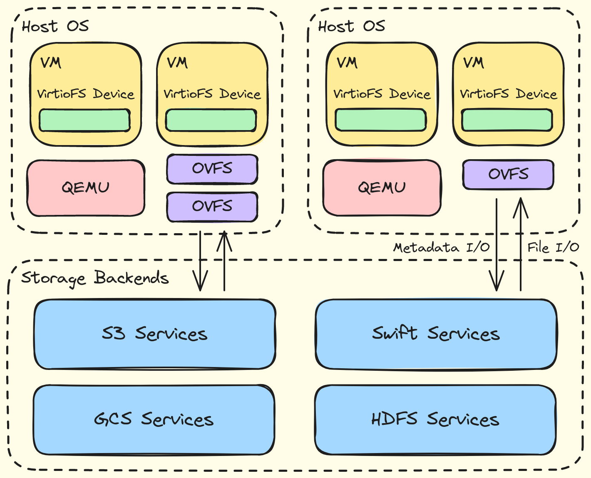

# OVFS, OpenDAL File System via Virtio

OVFS is a backend implementation of VirtioFS. It provides a filesystem interface for VMs based on [OpenDAL](https://github.com/apache/opendal), aiming to accelerate VMs IO performance by VirtIO and seamlessly connect with various storage backends.



## How to Use

The following components are required:
- Rust environment on the host to run OVFS.
- QEMU 4.2 or later for built-in VirtioFS support.
- A Linux 5.4 or later guest kernel for built-in VirtioFS support.

### Install QEMU and VMs

```shell
$ sudo apt-get -y qemu # debian/ubuntu
```

Download and install the VM, taking Ubuntu as an example:

```shell
$ wget https://releases.ubuntu.com/20.04/ubuntu-20.04.6-live-server-amd64.iso
$ truncate -s 10G image.img
$ sudo qemu-system-x86_64 -enable-kvm -smp 2 -m 4G \
    -cdrom ubuntu-20.04.6-live-server-amd64.iso \
    -drive file=image.img,format=raw,cache=none,if=virtio \
    -boot d
```

### Mount shared directory on VMs

Run OVFS and set the listening socket path and service configuration used:

```shell
host# cargo run --release <socket-path> <backend-url>
```

`backend-url` is the URL that includes the scheme and parameters of the service used, in the following format:

```markdown
- fs://?root=<path>
- s3://?root=<path>&bucket=<bucket>&endpoint=<endpoint>&region=<region>&access_key_id=<access-key-id>&secret_access_key=<secret-access-key>
```

Run the VM through QEMU and create a VirtioFS device:

```shell
host# sudo qemu-system-x86_64 --enable-kvm -smp 2 \
    -m 4G -object memory-backend-file,id=mem,size=4G,mem-path=/dev/shm,share=on -numa node,memdev=mem \
    -chardev socket,id=char0,path=<socket-path> -device vhost-user-fs-pci,queue-size=1024,chardev=char0,tag=<fs-tag> \
    -drive file=image.img,format=raw,cache=none,if=virtio \
    -net user,hostfwd=tcp::2222-:22 -net nic \
    -nographic -boot c
```

Mount a shared directory in the VM:

```shell
guest# sudo mount -t virtiofs <fs-tag> <mount-point>
```

For more examples, please refer to the test scripts in github actions of this repository.

## Periodic Reports During GSoC 2024
- [05.12-05.19](./docs/reports/05.12-05.19.md)
- [05.20-06.02](./docs/reports/05.20-06.02.md)
- [06.02-06.27](./docs/reports/06.02-06.27.md)
- [06.28-07.22](./docs/reports/06.28-07.22.md)
- [07.23-08.04](./docs/reports/07.23-08.04.md)
